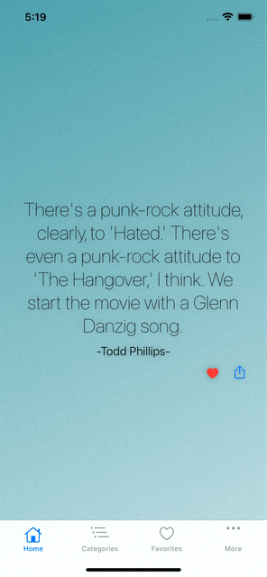
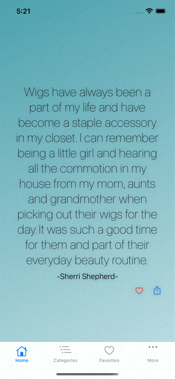
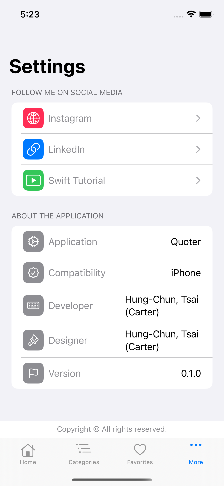

# SwiftUI - Quoter
 

| 1. Home Screen  | 2. Home Screen & Share | 3. Categories|
| ------------- | ------------- | ------------- | 
|  |  |  |

| 4. Favorites Screen  | 5. Setting Screen | 
| ------------- | ------------- |
|  |  |

Quoter includes a wide range of categories such as marriage, morning, motivational and movies... and more you and explore.

Different categories of quotes which will motivate your daily life.

You also can add your favourites quotes into your pocket in order to review them later!

Feature:
1. You can download the quotation image to your photo album
2. Totally 18 categories that you can explore on your wish
- General
- Attitude
- Beauty
- Best
- Marriage
- Medical
- Men
- Mom
- Money
- Morning
- Motivational
- Music
- Nature
- Parenting
- Patience
- Patriotism
- Peace

Privacy Policy: https://quoter-0.flycricket.io/privacy.html
Terms of use: https://quoter-0.flycricket.io/terms.html

## Features

- [x] Implement Core Data framework to persist user's data
- [x] Output Image to user's Album by using UIImageWriteToSavedPhotosAlbum 
- [x] Decoding the local JSON Data and convert to custom object.

## Requirements

- iOS 13.0+
- SwiftUI

## Dependencies

This project use 
1. [SwiftUIPager](https://github.com/fermoya/SwiftUIPager) to achieve scrollable page.

## Installation

Clone the project and run in your local workstation. 

## Acknowledgements
- This project quotation data are from [GoQuotes](https://goquotes.docs.apiary.io/#reference/get-random-quote(s)/apiv1random)

## AppStore Link
[Quoter](https://apps.apple.com/jm/app/quoter/id1566934513)

## Contact
Created by [@Hung-Chun, Tsai (Carter)](linkedin.com/in/hung-chun-carter-tsai-372584175) - feel free to contact me!

<i>Follow me around the web:</i> 

<!-- <a target="_blank" href="https://www.linkedin.com/in/hung-chun-carter-tsai-372584175/">🇱​🇮​🇳​🇰​🇪​🇩​🇮​🇳​</a> ●
<a target="_blank" href="https://www.instagram.com/hungchun.tsai/">🇮​🇳​🇸​🇹​🇦​🇬​🇷​🇦​🇲​</a> ●
<a target="_blank" href="https://www.facebook.com/hongjun.cai.5">🇫​🇦​🇨​🇪​🇧​🇴​🇴​🇰​</a> ● -->

